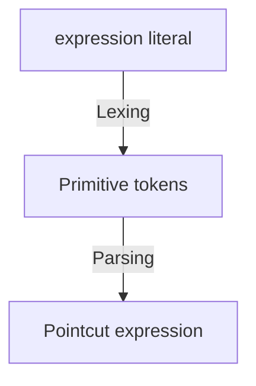
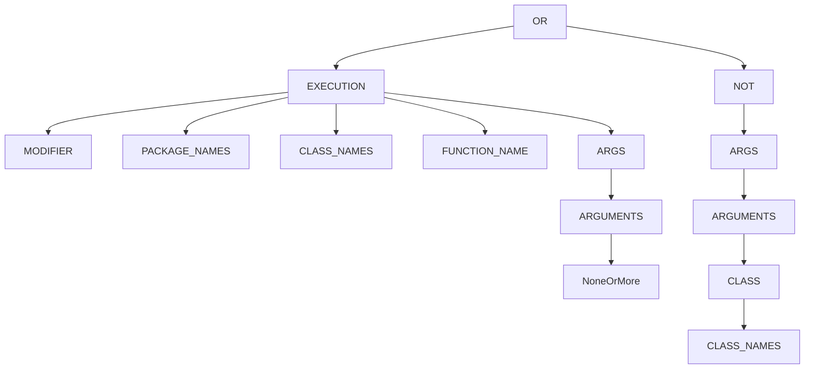

# aspectk-expression

This module provides lexer and parser for AspectK expression language.

- [Lexer](src/main/kotlin/com/github/kitakkun/aspectk/expression/lexer/AspectKLexer.kt): parses AspectK expression literal into primitive tokens.
- [TokenParser](src/main/kotlin/com/github/kitakkun/aspectk/expression/tokenparser): transform primitive tokens into expression-specific tokens.
- [Parser](src/main/kotlin/com/github/kitakkun/aspectk/expression/expressionparser/PointcutExpressionParser.kt): parses tokens into expression tree with help of TokenParsers.
- [Matcher](src/main/kotlin/com/github/kitakkun/aspectk/expression/matcher/PointcutExpressionMatcher.kt): matches declarations with expressions.

## AspectK expression language

AspectK expression language is a simple language to define pointcuts which determines which functions to be intercepted.

### Operators

| Operator | Description                            | example                         |
|----------|----------------------------------------|---------------------------------|
| `&&`     | combine two pointcuts with logical and | `execution(...) && args(...)`   |
| `\|\|`   | combine two pointcuts with logical or  | `execution(...) \|\| args(...)` |
| `!`      | negate a pointcut                      | `!execution(...)`               |

### Pointcuts

All pointcuts are defined in the form of `pointcutName(arg1 arg2 ...)` or `pointcutName(arg1, arg2, ...)`.
There are several pointcuts available in AspectK expression language.

- `execution`: matches the execution of a function.
- `args`: matches the arguments of a function.
- `named`: references pointcut expression defined in other places.

## Architecture



### Construction of expression tree

Let's think about the following expression:

```
execution(public MyClass.myMethod(..)) && !args(String)
```

This expression is tokenized into the following primitive tokens (whitespaces are ignored):

```
IDENTIFIER(execution) LEFT_PAREN IDENTIFIER(public) IDENTIFIER(MyClass) LEFT_PAREN DOUBLE_DOT RIGHT_PAREN RIGHT_PAREN AND NOT IDENTIFIER(args) LEFT_PAREN IDENTIFIER(String) RIGHT_PAREN
```

Then, [PointcutExpressionParser](src/main/kotlin/com/github/kitakkun/aspectk/expression/expressionparser/PointcutExpressionParser.kt) analyzes these tokens from the beginning and constructs an
expression
tree like below.



> [!NOTE]
> `PointcutExpressionParser` is not responsible for parsing each pointcut arguments such as `public ... myMethod(..)` part of `execution` pointcut.
> It only analyze tree structure of the expression such as `&&`, `||`, `!` operators.

During the parsing process, `PointcutExpressionParser` invokes `TokenParser` to parse each pointcut arguments.
For example, when a pointcut `execution` is detected,
`PointcutExpressionParser` analyze its arguments range(from left parenthesis to right parenthesis)
and pass corresponding tokens to `ExecutionTokenParser`.

Then, `ExecutionTokenParser` will return `PointcutExpression` object which represents `execution` pointcut.
Like this, we will get a tree structure of the pointcut expression.

### Matching

To match the pointcut expression with a declaration, you can use [PointcutExpressionMatcher](src/main/kotlin/com/github/kitakkun/aspectk/expression/matcher/PointcutExpressionMatcher.kt).
It takes a pointcut expression as a constructor argument and provides `matches` method to match the expression with an actual declaration.

`matches` method takes to arguments: `functionSpec` and `namedPointcutResolver`.

`functionSpec` represents a function declaration. It contains required information to detect if the function matches the pointcut expression or not.
For example, package name, class name, function name, and so on.

`namedPointcutResolver` is a lambda function to resolve named pointcut expressions.
It takes a named pointcut expression as an argument and returns a corresponding pointcut expression.
When a named pointcut expression is detected, `PointcutExpressionMatcher` will call this lambda function to resolve the named pointcut expression.
